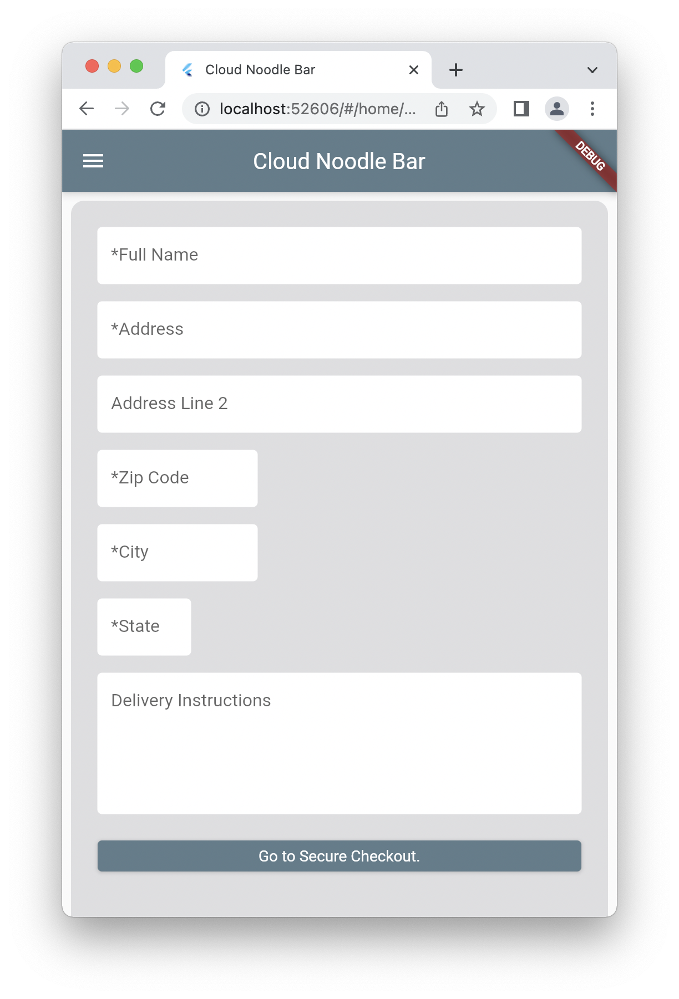
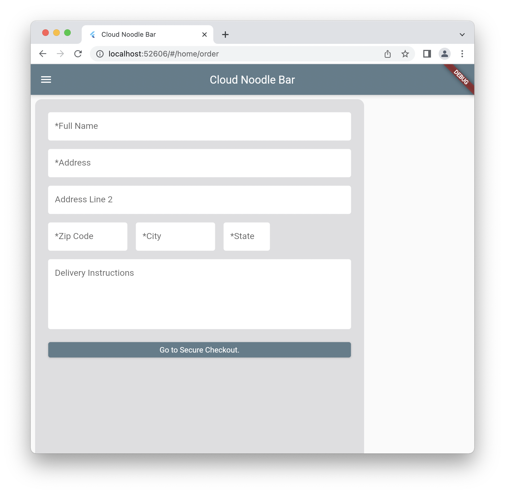

# cloudnoodlebar

Order cup of noodles and get them delivered.

## Getting Started

clone the project

## The Design Of Our Screens

### CNB Laws of Design

[Principles of Design.](https://xd.adobe.com/ideas/process/ui-design/design-composition-key-principles/https://xd.adobe.com/ideas/process/ui-design/design-composition-key-principles/)
[Check Out fonts.](https://fonts.google.com)

You enter a site like you enter any other space - restaurants, homes, malls, etc.
The vibes you get from a website should be similar to the vibes you get from
a physical space. You can set the vibe by changing the following variables:
 - Typography: See [principles of typography](https://medium.muz.li/why-ui-design-is-all-about-typography-370250d89ce8),
 [popular fonts](https://www.typewolf.com), and [font pairings](https://www.fontpair.co).
 - Colors
 - Visual Imagery and Art style.
 - Vocabulary

With our site, we want to be reminiscent of the cluttered home lab of a biologist, geologist,
or other kind of -ologist. Papers and journals everywhere with different formulas
and inventions, as well as the life work of the -ologist, some high tech innovative thing,
sitting on a table.

The fonts we use for our site is Poppins and Lora. Poppins is for the CLOUD NOODLE BAR title
to give it an innovative, new, startup vibe. Lora is more classics oriented, and will be used
for any old-school info on the site like methodologies. We might switch to the typeface
DONGLE because it's so round.

### A Responsive UI

<p float="left">


</p>

References:
[Developing for Multiple Screen Sizes and Orientations in Flutter (Fragments in Flutter)](https://medium.com/flutter-community/build-responsive-uis-in-flutter-fd450bd59158)

We want our layout to change depending on what screen size the
user has. Otherwise things might look weird.

For the most part, follow the design of the shipping details
for a responsive UI. These classes are fairly large and contain
one function called `_buildMobile()` and another called `_buildWeb()`
that both return a widget. This widget in question is the entire
view for mobile-sized screens (small screens) or web-sized screens
(large screens). The class then has this build function:

```
@override
  Widget build(BuildContext context) {
    if (MediaQuery.of(context).size.width > 600) {
      isMobileViewPort = false;
    } else {
      isMobileViewPort = true;
    }
    return(
      isMobileViewPort? _buildMobile(): _buildWeb()
    );
```

In order to control which view is required, the boolean
`bool isMobileViewPort` is used as a class property.

Note that this is only used for high level widgets that build layouts. The primary widgets used to build the layout
(the CustomTextField widget, for example) don't have this
property.

## Analytics

We use Google Analytics.
